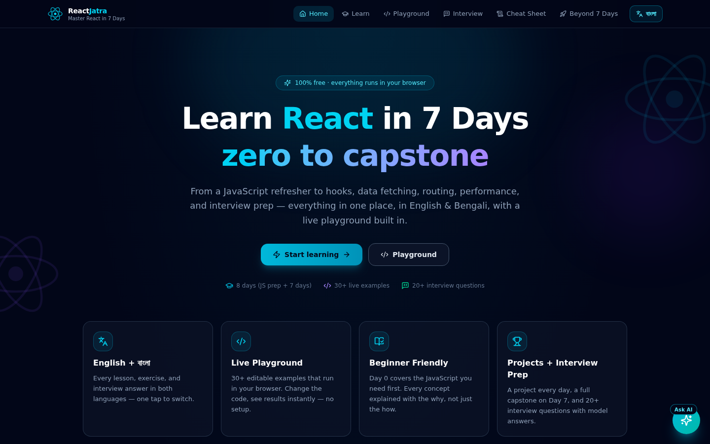
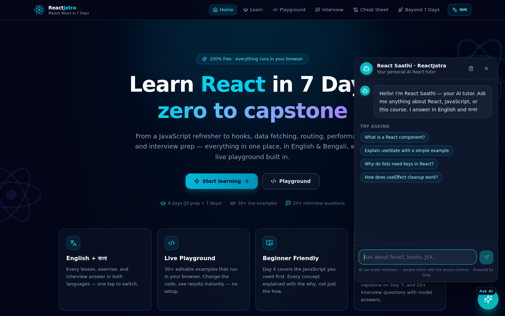

<div align="center">

# ⚛️ ReactJatra

**Learn React in 7 days — in English ও বাংলা!**

A complete, self-contained interactive React course with a live code playground,
guided exercises, interview prep, and a bilingual AI tutor powered by Groq.

[](https://nextjs.org)
[](https://react.dev)
[](https://www.typescriptlang.org)
[](https://tailwindcss.com)
[](https://groq.com)

[**🔴 Live Demo — reactjatra.vercel.app**](https://reactjatra.vercel.app) · [Curriculum](#-curriculum) · [Features](#-features) · [Quick Start](#-quick-start) · [Deploy](#-deploy-to-vercel)



</div>

---

## 🎯 What is ReactJatra?

**ReactJatra** (*jatra* = যাত্রা = *journey* in Bengali) takes you from **zero JavaScript experience to a deployed React app in 7 days** — right in your browser, in **your language**.

Every concept is taught three ways: a plain-language explanation, a runnable code example, and a hands-on exercise with a revealable solution. No setup, no tooling hell, no “just trust me” — you read, you run, you build.

## ✨ Features

| | Feature | What you get |
|---|---|---|
| 🌍 | **Bilingual UI + content** | Every lesson, exercise, interview answer and AI reply in **English and বাংলা** — switch instantly with one click |
| 📅 | **8-day curriculum** | Day 0 JS refresher → Day 7 capstone: components, hooks, effects, routing, performance, deployment |
| 🧪 | **Live playground** | 20+ editable examples that run in your browser — change code, see results instantly (no setup) |
| 🏋️ | **27 exercises + 7 timed challenges** | Each with starter code, hints, and full solutions |
| 🤖 | **AI tutor — “React Saathi”** | Ask anything, get streaming answers *with runnable code* in English or Bengali (Groq ⚡) |
| 💼 | **Interview prep** | 20 real interview Q&A (core / hooks / intermediate / coding rounds) |
| 📋 | **Cheat sheet** | 22 quick-reference snippets across 10 sections |
| 🚀 | **Beyond 7 days** | Styling, composition patterns, debugging, project structure, TypeScript, React 19 |
| 📊 | **Progress tracking** | Mark days complete, resume where you left off |
| 📱 | **Fully responsive** | Phone, tablet, desktop |

## 📅 Curriculum

| Day | Topic | What you'll learn |
|---|---|---|
| **0** | JS You MUST Know | Arrow functions, destructuring, spread/rest, `map`/`filter`/`reduce`, template literals, ES modules, `async/await`, `fetch` |
| **1** | Foundations | Components, JSX rules, props, `children`, list rendering with `key`, conditional rendering, events |
| **2** | State | `useState`, controlled inputs, immutable updates, lifting state up, batching |
| **3** | Effects & Data Fetching | `useEffect`, dependency arrays, cleanup, `AbortController`, loading/error states, stale closures |
| **4** | Advanced Hooks | `useRef`, `useContext`, `useReducer`, custom hooks (`useLocalStorage`) |
| **5** | Routing & Forms | React Router (`Routes`, `Link`, `useParams`, `useNavigate`, nested/protected routes), forms, react-hook-form |
| **6** | Performance | `React.memo`, `useMemo`, `useCallback`, `React.lazy` + `Suspense`, error boundaries, virtual DOM, Redux Toolkit / Zustand |
| **7** | Capstone | Build & ship a complete app + deployment (Vercel/Netlify) |

## 🤖 The AI Tutor

Click the glowing **Ask AI** button anywhere in the app to chat with **React Saathi** (রিয়্যাক্ট সাথী — “React companion”):

- **Answers in your language** — switch the app to বাংলা and the tutor replies in Bengali (or ask in English anytime)
- **Streaming answers** with runnable, syntax-highlighted code blocks and one-click copy
- **Lesson-aware** — it knows which day you're studying and tailors answers to it
- **Beginner-first** — jargon explained simply, common mistakes called out

The tutor is served by a Next.js API route that calls the **Groq API** (Llama 3.3 70B) server-side, so your API key never reaches the browser.



## 🛠 Tech Stack

- **[Next.js 16](https://nextjs.org)** (App Router) + **React 19** + **TypeScript**
- **Tailwind CSS 4** + **shadcn/ui** + **Lucide icons** + **Framer Motion**
- **[react-live](https://github.com/FormidableLabs/react-live)** for the in-browser playground
- **[react-markdown](https://github.com/remarkjs/react-markdown)** + **react-syntax-highlighter** for lesson & AI content
- **Groq API** (`openai/gpt-oss-120b`, with automatic model fallbacks) for the AI tutor, streamed through a server route

## 🚀 Quick Start

> **Prerequisite:** Node.js 18+ (or [Bun](https://bun.sh) 1.1+) and a free Groq API key for the AI tutor.

```bash
# 1. Clone
git clone https://github.com/ado1d/reactjatra.git
cd reactjatra

# 2. Install dependencies
bun install        # or: npm install

# 3. Configure the AI tutor
cp .env.example .env.local
#    → open .env.local and paste your Groq key (https://console.groq.com/keys)

# 4. Run
bun run dev        # or: npm run dev
```

Open <http://localhost:3000> and start with Day 0. That's it — the playground runs entirely in your browser, no other setup needed.

### Environment Variables

| Variable | Required | Description |
|---|---|---|
| `GROQ_API_KEY` | ✅ for AI tutor | Groq API key — [get one free](https://console.groq.com/keys). Server-side only. |
| `GROQ_MODEL` | ❌ | Override the model (default: `openai/gpt-oss-120b`) |

## 📦 Scripts

| Command | What it does |
|---|---|
| `bun run dev` | Start the dev server on port 3000 |
| `bun run lint` | ESLint check |
| `bun run build` | Production build |
| `bun run start` | Serve the production build |

## ▲ Deploy to Vercel

The app is Vercel-ready — every push to `main` can be deployed:

1. Import the repo at [vercel.com/new](https://vercel.com/new) (framework auto-detected as **Next.js**)
2. Add the environment variable `GROQ_API_KEY` (Production + Preview)
3. Deploy 🚀

Or with the CLI:

```bash
npm i -g vercel
vercel link
echo "your_groq_key" | vercel env add GROQ_API_KEY production preview
vercel deploy --prod
```

## 📁 Project Structure

```
src/
├── app/                    # Next.js App Router shell (single "/" route + AI API route)
│   ├── api/ai/chat/        #   streaming Groq proxy (server-side, key-safe)
│   ├── layout.tsx          #   fonts (Geist + Noto Sans Bengali) & metadata
│   └── page.tsx            #   hash-routed SPA shell
├── components/learning/    # Navbar, HomeView, LessonView, Playground, AI assistant, …
├── content/                # 📚 the whole course — 8 days, interview, cheatsheet, extras
│   └── days/day0…day7.ts   #   bilingual lesson data (EN + বাংলা)
└── lib/                    # i18n context, hash router, progress tracker
```

## 🤝 Contributing

Found a typo, a bug, or want to add a lesson? PRs are welcome — the curriculum lives in `src/content/` as plain TypeScript data with `{ en: "...", bn: "..." }` strings, so it's easy to extend or translate.

## 📄 License

[MIT](LICENSE) © [ado1d](https://github.com/ado1d)

---

<div align="center">

**শিখুন → বানান → ডিপ্লয় করুন।** Learn → build → ship. ⚛️

</div>
